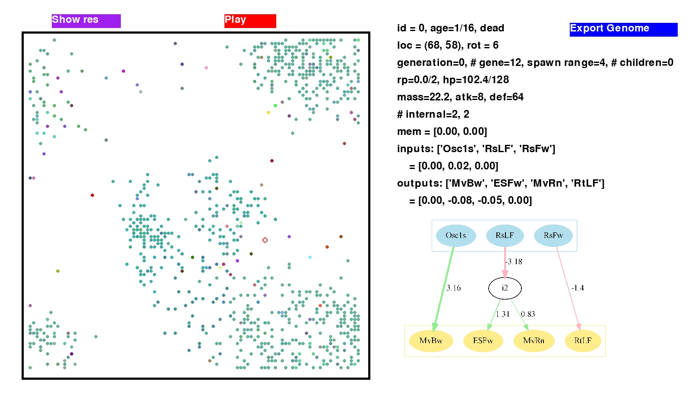

# Genetic-CA
A customizable genetic cellular automata simulator with pygame GUI. 

 

## Features
- save/load world states
- click on cell and view its state, genetic sequence, and phenotype informations
- display phenotype neural network
- customizable cell functions and states
- customizable resource spawn
- cells colorized by genetic similarity

## Quick Start
```
python gui.py
```
Run and enjoy watching the world evolves itself!
